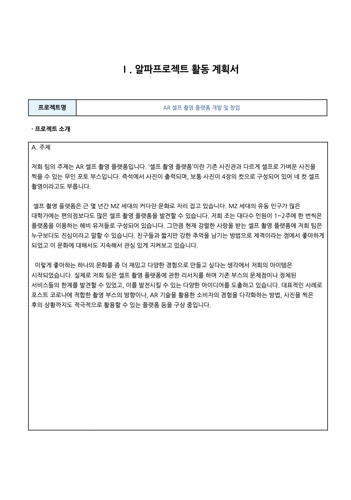

# 2023 PhotoBubble
>   네컷 사진은 현대 사진 트렌드 중 하나로, 인스타그램부터 소셜 미디어 전반에 걸쳐 활발하게 활용되고 있다. 
>   
>   
>   그러나 네컷 사진을 촬영할 때 가장 주의해야 할 문제 중 하나는 소품의 관리와 위생이다. 
>   
>   
>   특히 공용 소품이나 외부에서 대여한 소품을 사용할 때, 위생 문제로 인해 사진 촬영에 제약을 느끼는 경우가 많다.
>   
>   
>   이 앱은 사용자들이 3D 모델링된 가상 소품을 선택하여 네컷 사진을 촬영할 수 있도록 지원한다. 
>   
>   
>   이를 통해 사용자는 실제 소품을 사용하지 않고도 다양한 소품을 선택하고 조합하여 더욱 창의적이고 위생적인 사진을 촬영할 수 있다.

  

## 📌 주요 기능

`다양한 소품 선택`: 3D 모델링 기술을 통해 다양한 소품을 제공하므로, 사용자는 자신의 취향과 촬영 주제에 맞는 소품을 선택할 수 있다.

`위생적인 촬영 환경`: 외부에서 대여한 소품의 위생 문제를 걱정할 필요 없이, 가상 소품을 활용하여 위생적인 촬영 환경을 유지할 수 있다.

`실시간 편집 및 조합`: 포토버블은 사용자들이 실시간으로 소품을 편집하고 조합할 수 있는 기능을 제공한다. 이를 통해 촬영 전 미리 소품을 조합하고 배치하여 원하는 이미지를 완성할 수 있다.

`필터 QR 저장 및 구경하기`: 사용자가 저정한 필터를 QR로 저장하고, 포토부스에서 QR을 인식해 촬영 구경하기를 통해 다른 사람들의 필터 정보를 확인할 수 있다.

  

## 최종 프로젝트 보고서

  

| 활동 계획서 | FIGMA |
|:---:|:---:|
|||

  
